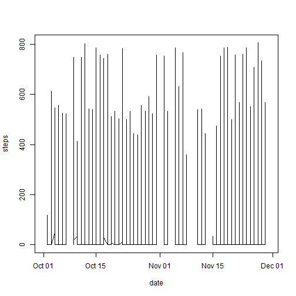

# Reproducible Research: Peer Assessment 1
**Author:** Florian Knaus
**Last changed:** May 18, 2014
## Introduction
This document is for the Peer Assessment 1 of the Coursera Reproducible Research course by Roger Peng.


## Loading and preprocessing the data
First we set the working directory:

```r
setwd("C:/Users/Florian/Documents/Development/git/RepData_PeerAssessment1")
```

Then we read the file "activity.csv" and format the date column

```r
activity <- read.table(file = "activity.csv", header = TRUE, sep = ",", colClasses = c("numeric", 
    "character", "numeric"))
activity$date <- as.Date(activity$date, "%Y-%m-%d")
```


## What is mean total number of steps taken per day?
We create a histogram and use functions mean and median on column 'steps' of data-frame 'activity' and remove any possible 'NA' values.

```r
hist(activity$steps, main = "Histogram of Steps", xlab = "Steps")
```

 

```r
mean(activity$steps, na.rm = TRUE)
```

```
## [1] 37.38
```

```r
median(activity$steps, na.rm = TRUE)
```

```
## [1] 0
```


## What is the average daily activity pattern?


```r
with(activity, plot(x = date, y = steps, type = "l"))
```

 

```r
with(activity, plot(x = date, y = interval, type = "l"))
```

 


## Imputing missing values


## Are there differences in activity patterns between weekdays and weekends?


